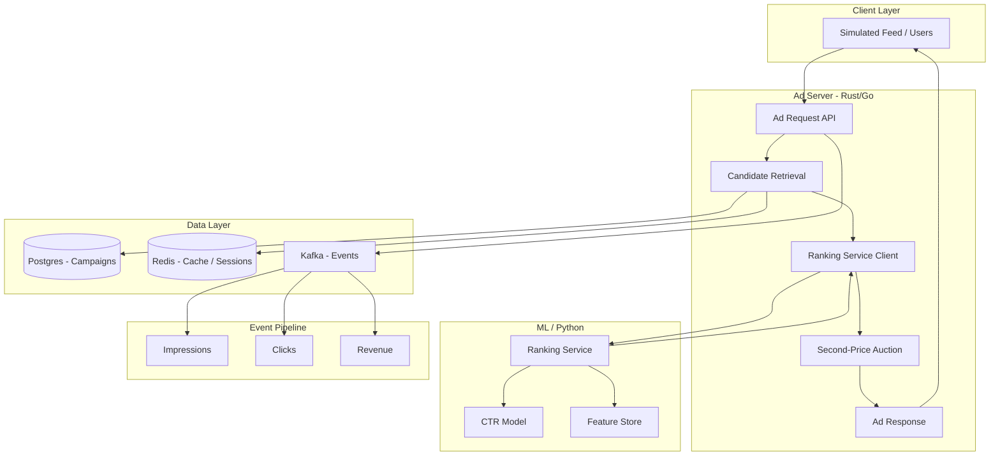

# AI-Powered Ad Ranking & Auction Engine — Build Plan

## Architecture Overview



---

## 1. Repository and Monorepo Layout

- **Single repo**, services in subfolders with a root `docker-compose.yml` and optional `docker-compose.cloud.yml` for prod.
- Suggested layout:

```
ad-ranking-engine/
├── ad-server/          # Rust or Go — HTTP API, candidate fetch, auction
├── ranking-service/    # Python — CTR model, feature store client, ranking
├── feature-store/      # Python — simple feature store (e.g., Redis + offline batch)
├── event-consumer/     # Rust/Go or Python — consume Kafka, write to Postgres/analytics
├── dashboard/          # React — campaigns, performance, suggestions
├── simulator/          # Optional — script/tool to simulate feed traffic
├── deploy/             # Dockerfiles, K8s/ECS/Terraform or GCP equivalents
├── docs/               # ADR, runbooks, API specs
└── docker-compose.yml
```

---

## 2. Data Model and Storage

**Postgres (campaign data):**

- **Campaigns**: id, advertiser_id, name, budget, status, start/end date.
- **Ads**: id, campaign_id, creative (title, body, image_url), target_criteria (optional).
- **Auction results / aggregated stats**: campaign_id, date, impressions, clicks, spend, revenue (or separate events table plus materialized views).

**Redis:**

- Cache top-N candidate ad IDs or full payloads per placement/segment (optional TTL).
- Session or request-scoped data for ranking (e.g., user/context features) if not in Kafka.

**Kafka:**

- Topics: `ad-requests`, `impressions`, `clicks`, `auction-events` (or one unified `ad-events` with type).
- Events carry: request_id, user_id, ad_id, campaign_id, bid, price_paid, timestamp, context (placement, device, etc.).

---

## 3. Ad Server (Rust or Go)

**Role:** Handle ad requests at high throughput: retrieve candidates, call ranking service, run auction, return winner and log events.

- **Rust:** Strong fit for latency and throughput; use Axum or Actix for HTTP; async with tokio; gRPC or HTTP to ranking service.
- **Go:** Faster to iterate; use Gin or Chi; gRPC or HTTP to ranking service; good observability and cloud integrations.

**Core flow:**

1. **Ad request** (e.g. `GET /v1/ads?user_id=…&placement=feed&limit=1`).
2. **Candidate retrieval:** Query Postgres (and/or Redis cache) for eligible ads (e.g. by campaign status, budget, targeting).
3. **Ranking:** Send candidates + context (user_id, placement, device) to **ranking-service**; get back scores (e.g. pCTR) and optionally bid multipliers.
4. **Auction:** Run **second-price auction** on (e.g.) `score * bid` or `bid` only; winner pays second-highest price (or reserve).
5. **Response:** Return winning ad creative; async log impression (and later click) to Kafka.
6. **Budget:** Decrement spend in Postgres/Redis (or eventual consistency via event consumer).

**Key design choices:**

- Timeouts and circuit breakers for ranking-service calls.
- Minimal payload to ranking service (IDs + context); ranking service pulls features from feature store if needed.

---

## 4. Ranking Service (Python)

**Role:** Score candidates (e.g. pCTR) and optionally apply bid modifiers for auction.

- **Framework:** FastAPI; expose one endpoint e.g. `POST /rank` with list of (ad_id, context) and return list of (ad_id, score).
- **Model:** Simple baseline (e.g. logistic regression or small gradient-boosted tree) trained on historical impressions/clicks; optional neural model later.
- **Features:** User (e.g. segment, history), ad (e.g. campaign, creative type), context (placement, device). Stored in **feature store**; ranking service fetches per request or in batch.
- **Output:** Scores (and optionally effective_bid = bid * score) for the ad server to run second-price auction.

**Training pipeline (offline):**

- Consume impressions/clicks from Kafka (or from Postgres if logged there by event-consumer); build training dataset.
- Train model; export (e.g. pickle, ONNX, or model server); ranking service loads and serves.

---

## 5. Feature Store (Simple)

**Role:** Serve low-latency features for ranking (user, ad, context).

- **Online:** Redis (or in-memory cache) keyed by `user_id`, `ad_id`; values = JSON or binary feature vector; TTL to avoid stale data.
- **Offline:** Postgres or Parquet + script to compute features (e.g. click rate per ad, user activity); job to push into Redis.
- **API:** Either embedded in ranking-service (Python reads Redis) or a tiny service (e.g. Python FastAPI) that ranking-service calls. Prefer starting with "ranking-service reads Redis" to reduce moving parts.

---

## 6. Second-Price Auction

- **Bid:** Per ad, use `bid` from campaign (or `effective_bid = bid * pCTR` if you want revenue × engagement).
- **Sort** by bid (or effective_bid); winner = first, **price_paid = second-highest bid** (or reserve price if only one bidder).
- **Tie-breaking:** Deterministic (e.g. by ad_id) to avoid bias.
- Log in Kafka: winner, price_paid, all bids (for analysis and training).

---

## 7. Event Streaming and Event Consumer

**Kafka:**

- Ad server produces: impression (ad_id, campaign_id, user_id, price_paid, timestamp), click (same + request_id), and optionally raw auction events.
- **Event consumer:** Consume from Kafka; write to Postgres (aggregated stats or raw events); optionally update Redis (e.g. spend counters); feed training pipeline (e.g. export to S3/GCS for Python training).

**Technology:** Same as ad server (Rust/Go) for throughput, or Python if simplicity preferred; ensure at-least-once processing and idempotency where needed.

---

## 8. React Dashboard

- **Screens:** Campaign list and detail; ad list; performance (impressions, clicks, CTR, spend, revenue) over time; optional optimization suggestions (e.g. "increase bid for segment X", "pause low CTR ads").
- **Backend for dashboard:** Either ad-server exposes REST for analytics, or a small **dashboard-api** (Python/Go) that reads from Postgres and optionally from Kafka/streaming for real-time.
- **Auth:** Start with simple API key or no auth for MVP; add auth (e.g. JWT, OIDC) when needed.

---

## 9. Simulated Feed and Traffic

- **Script or small app** that periodically calls `GET /v1/ads?user_id=…` (and later `POST /v1/click` or similar) to simulate impressions and clicks.
- Use varied user_ids and placements to generate training data and load testing.

---

## 10. Docker and Cloud Deploy

- **Docker:** One Dockerfile per service (ad-server, ranking-service, feature-store if separate, event-consumer, dashboard); `docker-compose.yml` for Postgres, Redis, Kafka, and all services locally.
- **Cloud:**
  - **AWS:** ECS/Fargate or EKS for services; RDS (Postgres); ElastiCache (Redis); MSK (Kafka); S3 for model/artifacts; optional Lambda for training triggers.
  - **GCP:** Cloud Run or GKE; Cloud SQL; Memorystore; Confluent or Pub/Sub + Dataflow if you prefer to substitute Kafka; GCS for artifacts.
- **Secrets:** Use AWS Secrets Manager / GCP Secret Manager or env files in dev; never commit secrets.

---

## 11. Implementation Phases

| Phase | Focus | Deliverables |
|-------|--------|--------------|
| **1. Foundation** | Data model, Postgres + Redis + Kafka in Docker; ad-server stub (candidate retrieval only, no ML); one fixed "auction" (e.g. random or highest bid) | DB schema, migrations, docker-compose, ad-server returning one ad |
| **2. Auction & Events** | Second-price auction in ad-server; log impressions/clicks to Kafka; event-consumer → Postgres | Correct auction, event topics, aggregated stats in Postgres |
| **3. Ranking & ML** | Feature store (Redis + offline job); ranking-service (Python, simple model); ad-server calls ranking then auction | pCTR model, ranking API, end-to-end ranked auction |
| **4. Training Pipeline** | Offline job: Kafka/Postgres → training data → train model → export; ranking-service loads new model | Repeatable training, model versioning |
| **5. Dashboard** | React app; dashboard API (from Postgres); campaign list, performance charts, simple suggestions | Usable dashboard for campaign performance |
| **6. Deploy & Harden** | Production Dockerfiles; deploy to AWS or GCP; load testing; basic monitoring and alerts | Cloud deployment, runbook |

---

## 12. Tech Choice: Rust vs Go for Ad Server

- **Rust:** Best latency and throughput; steeper learning curve and build times; strong for long-term performance-critical path.
- **Go:** Faster to ship; excellent tooling and readability; more than sufficient for "high-throughput" at moderate scale (e.g. 10k–100k RPS with tuning).

**Recommendation:** Start with **Go** unless the role explicitly prioritizes Rust or you already have Rust in house; you can prototype auction and integration quickly and swap in a Rust service later if needed.

---

## 13. Key Files to Add Early

- **ad-server:** `main.go` or `main.rs`, router, handlers for `GET /v1/ads`, `POST /v1/click` (or equivalent), candidate fetch, auction module, Kafka producer.
- **ranking-service:** `main.py`, FastAPI app, `rank` endpoint, feature fetch (Redis), model load and inference.
- **feature-store:** Redis schema and key naming; offline script to backfill user/ad features.
- **event-consumer:** Kafka consumer loop; Postgres upsert for campaign/ad stats.
- **dashboard:** Create-react-app or Vite + React; API client; pages for campaigns, performance, suggestions.
- **Root:** `docker-compose.yml` (Postgres, Redis, Kafka, Zookeeper if needed, and all services); `.env.example` for secrets and ports.

This plan gives you a clear path from zero to a working ad ranking and auction system with ML, event streaming, and a dashboard, and fits the profile of an xAl Ads–style role (ranking, auctions, high-throughput serving, ML, revenue-critical infrastructure).
